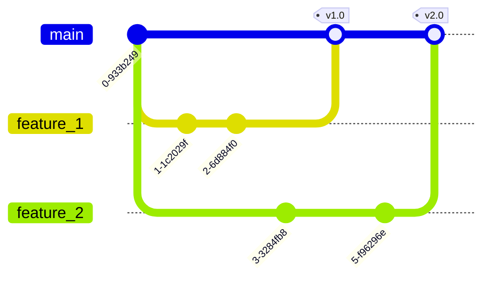

# How to development

- clone repogitory
- create feature branch from main branch



# Create Environment Variables

- Copy /app/core/envs/exampe.env -> .env.local

```
app
 ┗core
  ┗envs
   ┗env.local
```

# Docker

```
docker-compose build
docker-compose up
```

# API Documents

**precondition**

- docker running

```
http://localhos:8000/docs
or
http://localhost:8000/redoc
```

# Database

**precondition**

- docker running

**run command**

- into docker container

```
docker-compose exec db sh
```

- dummy data
  - to be continue
